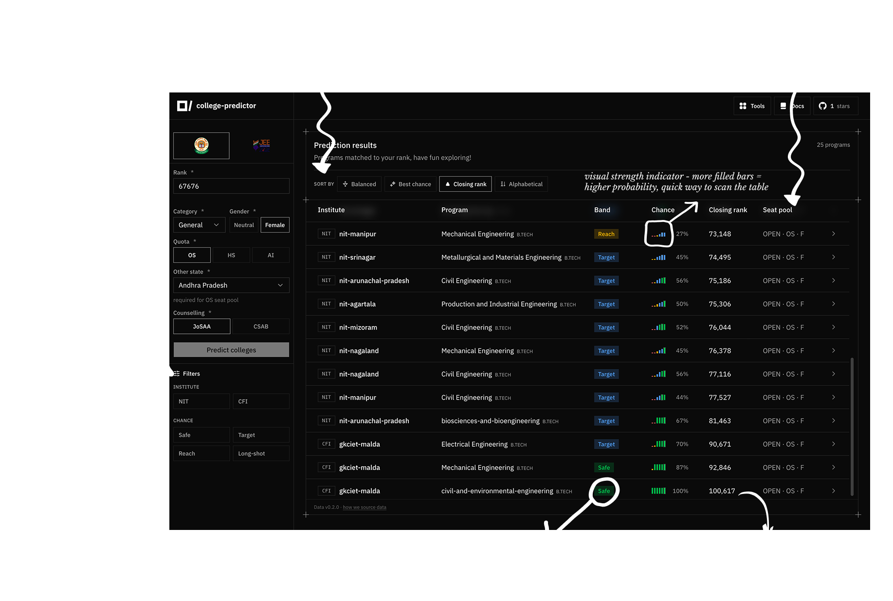
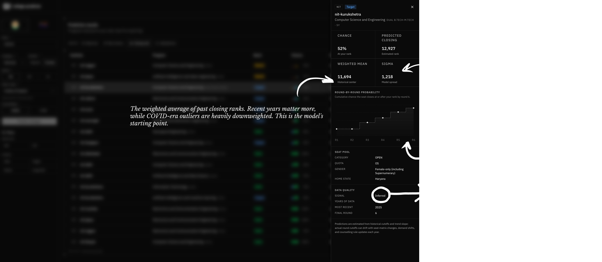
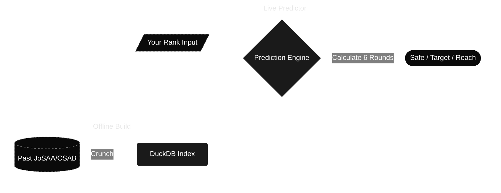

  

---

  <a href="docs/README.md">Documentation</a>
  ·
  <a href="CONTRIBUTING.md">Contributing</a>
  ·
  <a href="LICENSE">License</a>
  ·
  <a href="NOTICE">Notice</a>

 

## rant (#`^´)／

Indian exam culture sucks. somehow we built an education system where exams matter more than actually learning. and ofcourse wherever fear exists, someone finds a way to sell it.

Offline institutes. Online institutes. Schools. Nobody really cares about the *student.* everyone wants the billboard. ak aur factory. ak aur batch. ak aur advertisement.

 

> *"Education is not a race."*

...or at least it shouldn't be. I genuinely never understood why we're so sexually obsessed with ranks. A rank is just supposed to be a by-product. Not the entire purpose of learning. But here we are. Nothing changes because everyone already knows this. We rant. We complain. *fhir dusra batch aja ta hai*

 

Anyway... I completely forgot why I even started writing this. oh yeah! Here's why this repository exists.

**Pure. Frustration. That's it.**

 

Every tool for students online somehow manages to suck. Closed-source. Ads everywhere. "Buy this." "Buy that." Yeah buddy... I don't really want to buy those underwears. No, thank you.

And then comes the data collection. Like...

**Alakh sir, do you really need my date of birth, phone-number, rank?**

Papa mummy ka bhi DOB dedu? Time of birth bhi chahiye kya? Blood group? Aadhaar bhi le lo sir. 😭

 

*oh my fucking god.* These websites are literally extracting everything because they know students **need** them. And somehow... nothing better exists.

So... I built one at-least for myself and if it helps other too. Not something revolutionary. Not the biggest project ever. Just something I wish existed when I needed it. A collection of genuinely useful exam tools. No bullsh*t. Just tools.

 

**For students. From students.**

   

## tools (˶˃ ᵕ ˂˶) .ᐟ.ᐟ

  <code>Engineering</code> / <code>Tools</code> / <code>College Predictor</code>

 

 

  
    
  

 

A college predictor. It takes years of past JoSAA and CSAB closing ranks to estimate what you might actually get. Just a simple tool to save you some headache during counselling. (Will try to add more exams soon, but for now it's just JEE).

 

 

### how it works?

ejam use DuckDB offline to crunch the heavy data so the live site doesn't lag. 
all this happens when you use the college predector:

 

  [1]&nbsp;&nbsp; $\large \hat{c} = (\bar{w} + \mathrm{clamp}(m, \pm 0.03\bar{w}) \cdot 0.7 g)(1+s)^{g}$
  &nbsp;&nbsp;&nbsp;&nbsp;&nbsp;&nbsp;&nbsp;&nbsp;
  [2]&nbsp;&nbsp; $\large \sigma = \max(\sigma_w, 0.025\bar{w})$

 

Instead of blindly throwing last year's ranks at you, the offline index analyzes years of historical data. We give recent years heavier weight, mathematically trim out crazy COVID spikes, and bake in a slight trend nudge to account for the ~3% rank inflation we see every year.

This generates two key metrics: [**[1]**](docs/college-predictor/nerd-stuff/index-algorithms.md#predicted-closing-rank) calculates our best guess for where the closing rank will actually land this year, while [**[2]**](docs/college-predictor/nerd-stuff/index-algorithms.md#sigma-floor) determines how confident we are in that guess. If the historical data is sketchy, the margin of error automatically goes up.

 

  [3]&nbsp;&nbsp; $\large P_i = \Phi\!\left(\frac{\hat{c}_i - r}{\sigma}\right)$
  &nbsp;&nbsp;&nbsp;&nbsp;
  [4]&nbsp;&nbsp; $\large P_{\mathrm{cum}} = 1 - \prod(1-P_j)$
  &nbsp;&nbsp;&nbsp;&nbsp;
  [5]&nbsp;&nbsp; $\large \mathrm{score} = \frac{I}{100}\cdot\frac{B}{100}\cdot P$

 

When you enter your rank, the live prediction engine immediately goes to work. First, [**[3]**](docs/college-predictor/nerd-stuff/prediction-engine.md#single-round-probability) calculates your exact probability of getting into a specific branch for a single round.

But counselling has 6 rounds. To account for this, [**[4]**](docs/college-predictor/nerd-stuff/prediction-engine.md#round-by-round-cumulative-chance) stacks those probabilities, meaning a miss in Round 1 doesn't mean it's game over if you can slip in by Round 6.

Finally, getting a dead-end branch with 99% probability isn't actually helpful. To fix this, [**[5]**](docs/college-predictor/nerd-stuff/balanced-ranking.md#composite-formula) sorts your results using a composite score based on both *probability* and *institute quality*. This ensures a decent IIT at 60% chance rightly ranks higher than a bottom-tier college at 95%.

 

### TL;DR

 

  <a href="docs/README.md"><code><b>Read the full documentation ↗</b></code></a>

   

## credits [^._.^]ﾉ彡

  Dashboard layout adapted from <a href="https://efferd.com/">Efferd</a> by <a href="https://x.com/shabanhr">Shaban</a> 
  Charts adapted from <a href="https://evilcharts.com/">EvilCharts</a> by <a href="https://x.com/legionsdev">Gurbinder</a> 
  A few illustrations from <a href="https://icons8.com/">Icons8</a>

   

## sponsors /ᐠ. ｡.ᐟ\ᵐᵉᵒʷˎˊ˗

  

Hosting servers and crunching this much data isn't exactly free. If you found these tools useful and want to help keep it running, consider sponsoring. sponsorships go directly toward covering server costs and keeping the site completely ad-free.

  <a href="https://github.com/sponsors/su6u"><code><b>Sponsor the project 💖</b></code></a>

   

  <strong>→ <a href="docs/README.md">Documentation</a></strong>
  ·
  <strong><a href="https://ejam.in/college-predictor">Try College Predictor</a></strong>
  ·
  <strong><a href="https://github.com/su6u/ejam/issues/new?labels=tool-request&title=Tool+request%3A+&body=%23%23+Tool+name%0A%3C%21--+e.g.+NEET+college+predictor+--%3E%0A%0A%0A%23%23+What+should+it+do%3F%0A%3C%21--+What+problem+would+it+solve%3F+A+few+sentences+is+enough.+--%3E%0A%0A%0A%23%23+Who+is+it+for%3F%0A%3C%21--+e.g.+JEE+Main%2C+NEET+UG%2C+counselling+season+--%3E%0A%0A%0A%23%23+Anything+else%3F+%28optional%29%0A%3C%21--+Links%2C+screenshots%2C+or+similar+tools+you+like+--%3E%0A">Request a tool</a></strong>

