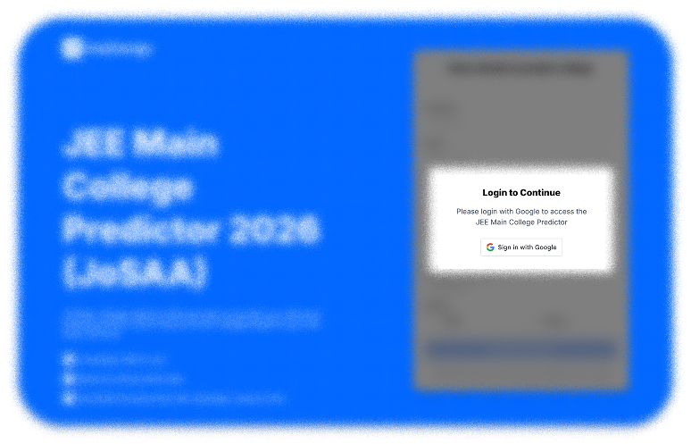
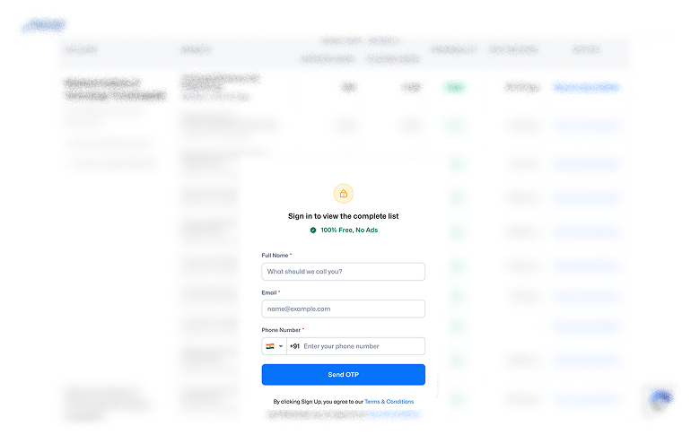
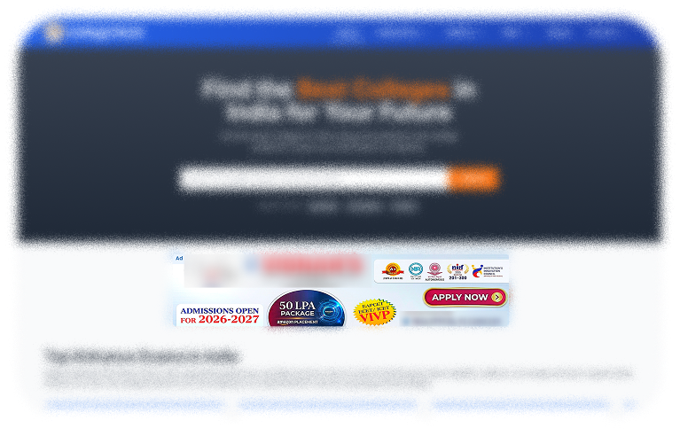

  <picture>
    <source media="(prefers-color-scheme: light)" srcset="apps/web/public/identity/icon.png">
    
  </picture>

  <strong>ejam.in</strong> 
  Open-source tools for students around Indian exams

  <a href="docs/README.md">Documentation</a>
  ·
  <a href="CONTRIBUTING.md">Contributing</a>
  ·
  <a href="LICENSE">License</a>
  ·
  <a href="NOTICE">Notice</a>

---

## Why this exists

Indian exam season means a flood of websites that promise to help: predictors, rank tools, guides, etc. Most of them are built to harvest your data first and help you second (like why tf do I need to give my data to use a simple tool). Ads everywhere, sign-up walls, phone number mandatory, then spam calls for weeks. Closed source, so you never know if the data/ tools is even reliable.

I started **ejam** as a hobby project to build the kind of tools I wished existed during my own exam season: free, open, no account, code you can read.

## What that looks like elsewhere

<table align="center">
  <tr>
    <td align="center" width="33%">
      
    </td>
    <td align="center" width="33%">
      
    </td>
    <td align="center" width="33%">
      
    </td>
  </tr>
</table>

Examples only. Not affiliated with any site shown.

## Tools

  <code>Engineering</code> / <code>Tools</code> / <code>College Predictor</code>

### College Predictor

First tool shipped. Enter counselling rank and profile (category, gender, quota, home state), get a sorted table of colleges and branches from historical **JoSAA** and **CSAB** cutoffs. Safe / Target / Reach bands, shareable links, no login.

| | |
| --- | --- |
| **Route** | `/college-predictor` |
| **Docs** | [college-predictor/README.md](docs/college-predictor/README.md) |
| **Start** | [Getting started](docs/college-predictor/learn/getting-started.md) |

Estimates from past cutoffs, not official allotment. Choice filling stays on government portals.

More tools may land under the same `Engineering / Tools` path as the project grows.

## Repo

| | |
| --- | --- |
| **License** | [AGPL-3.0](LICENSE) (code only; see [NOTICE](NOTICE) for data) |
| **Stack** | Next.js, DuckDB index build, public parquet datasets |
| **Contributing** | [CONTRIBUTING.md](CONTRIBUTING.md) |
| **Data releases** | [docs/DATA.md](docs/DATA.md) |

  <strong>→ <a href="docs/README.md">Documentation</a></strong>
  ·
  <strong><a href="docs/college-predictor/learn/getting-started.md">Try College Predictor</a></strong>

