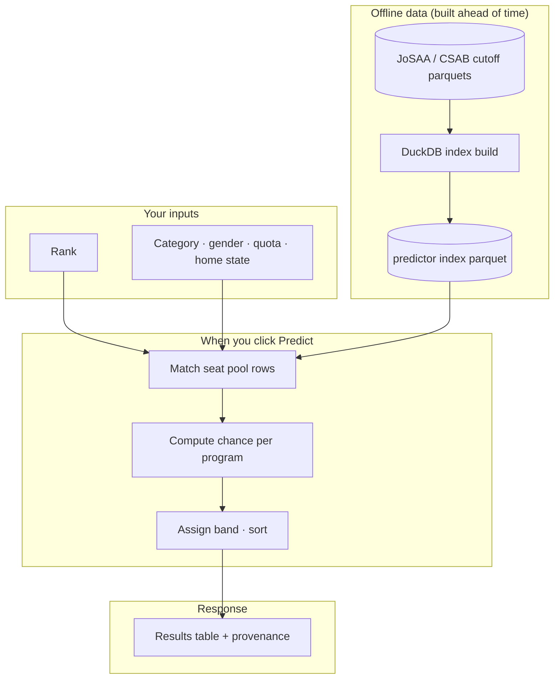

# How it works (overview)

The college predictor is not live seat allotment. It is a lookup plus statistics over **pre-built indexes** made from years of JoSAA and CSAB closing ranks.

## End to end

## Three exam paths

| Path | Index | What gets matched |
| --- | --- | --- |
| JEE Main + JoSAA | `college_predictor_index` | NIT, IIIT, CFI rows (IIT excluded) |
| JEE Advanced | `college_predictor_index` | IIT rows only, All India quota |
| JEE Main + CSAB | `csab_predictor_index` | NIT+, IIIT, CFI from CSAB history |

JoSAA and CSAB use **separate indexes** on purpose. Vacant-seat CSAB cutoffs are not the same pool as main JoSAA rounds.

## What happens on predict

1. **Validate inputs** (rank caps, required home state for OS/HS, category → seat type mapping).
2. **Load the index** for that exam path (checksum pinned by manifest version).
3. **Filter rows** to the student's seat pool: seat type, gender, quota rules, and exam-specific institute type.
4. **Score each program** using the student's rank against that row's predicted closing rank and uncertainty. See [From rank to results](from-rank-to-results.md).
5. **Drop very low chances** by default (below ~10%) unless `include_all=true`.
6. **Sort** (balanced by default) and return rows with provenance (which data release powered the run).

No request-time machine learning. Each row in the index already carries aggregated history; the API only runs the probability math.

## What it does not do

- Read live seat matrices or vacancy counts
- Simulate freeze / float / slide or choice order
- Submit or lock choices on JoSAA / CSAB portals
- Accept percentile or marks (rank only)

**Next:** [From rank to results](from-rank-to-results.md) for bands and chance columns. For build math and index weights, see [Index algorithms](../nerd-stuff/index-algorithms.md).
