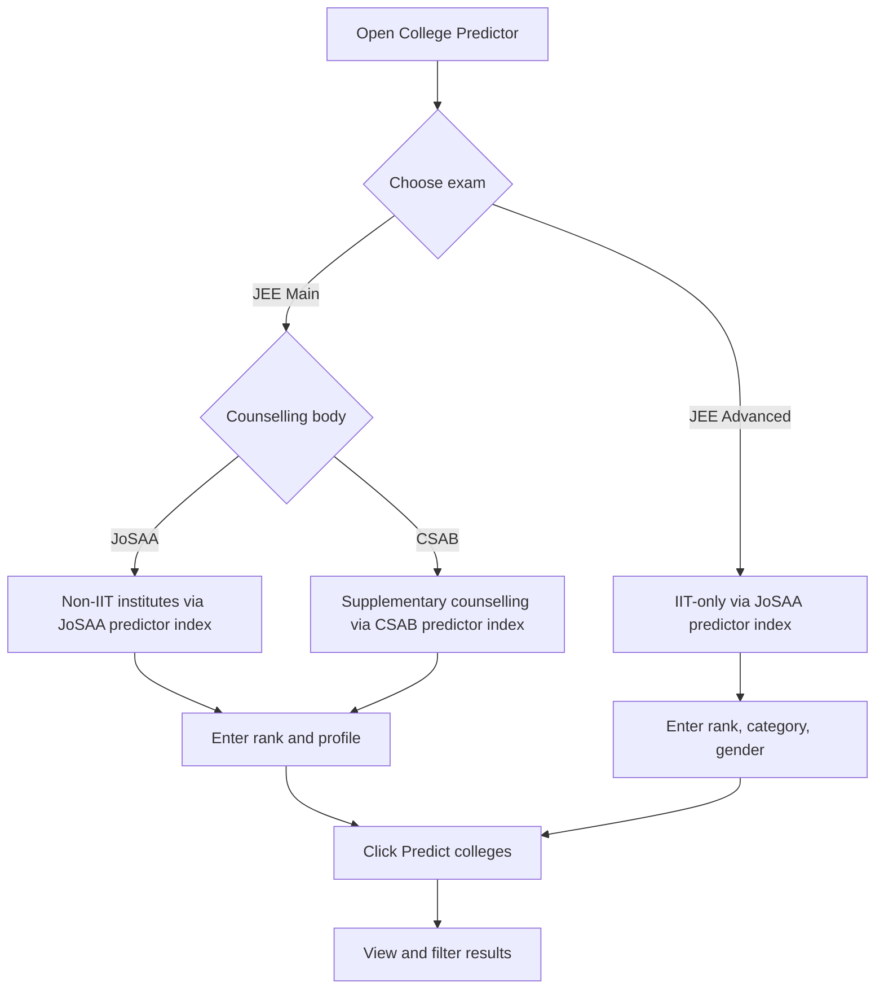

# Getting started

Open-source (AGPL) JEE counselling predictor. Feed it a rank and profile, get a table of likely college/branch options from historical JoSAA and CSAB cutoffs. Not official allotment.

## JEE counselling in one minute

| Body | When | Institutes |
| --- | --- | --- |
| **JoSAA** | After JEE Main / Advanced results | IITs (Advanced rank), NITs, IIITs, GFTIs |
| **CSAB** | After JoSAA rounds, for vacant seats | NIT+, IIIT, CFI; separate cutoffs from JoSAA |

JoSAA runs up to **six rounds** with freeze / float / slide. At NITs, **HS** (Home State) and **OS** (Other State) quotas depend on institute location vs domicile. Allotment uses **counselling rank** (a number), not percentile.

The predictor compares that rank to historical closing ranks and labels each option with a chance band. Estimates only; cutoffs move every year.

## Exam routing

## Steps

1. **Open the tool**  
   `/college-predictor` (home `/` redirects here when a share link has predictor params). Also on the tools grid.

2. **Pick an exam**

   **JEE Main:** NITs, IIITs, CFI through **JoSAA** (main six-round process) or **CSAB** (supplementary vacant seats).

   **JEE Advanced:** IITs only. Quota and home-state fields hidden; IIT JoSAA uses All India quota in this tool.

3. **Enter rank and profile**

   - **Rank:** counselling rank as a plain integer (not percentile, not marks). Caps: **500,000** for Main/CSAB, **50,000** for Advanced. [Why these limits](../faqs/faqs.md#what-are-the-rank-limits).
   - **Category:** General, Gen-EWS, OBC-NCL, SC, or ST (maps to official seat types).
   - **Gender:** Neutral or Female (includes supernumerary seats where data exists).

   For JEE Main, also set:

   - **Quota:** OS (default), HS, or AI
   - **Counselling:** JoSAA or CSAB
   - **Home state:** required for OS or HS (domicile state for seat-pool matching)

4. **Run prediction**  
   Click **Predict colleges**. Inputs sync to the URL for bookmarking/sharing.

   Complete URL on load auto-runs. Params: `rank`, `exam`, `counselling`, `category`, `gender`, `quota`, `state`, `ews`, `include_all`.

5. **Filter and sort**  
   Sidebar: institute type, band. Table header: Balanced, Best chance, Closing rank, Institute. Row click for round-by-round detail.

## Next steps

| Guide | Description |
| --- | --- |
| [What you need to know](what-you-need-to-know.md) | Rank, category, quota rules, GFTI vs CFI. |
| [How it works](../how-it-works/overview.md) | What happens under the hood. |
| [From rank to results](../how-it-works/from-rank-to-results.md) | Bands, chance column, closing rank. |

> **Warning:** Rough estimate from historical cutoffs. Not a seat guarantee. Official JoSAA, CSAB, and NTA portals are the source of truth.
