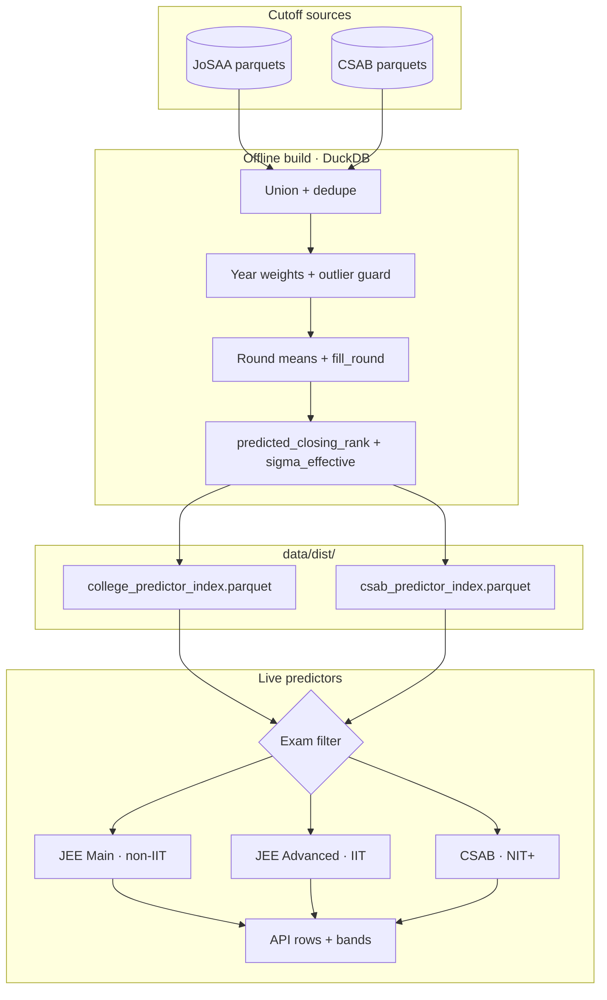

# Index algorithms

The predictor index is built offline with DuckDB. Each builder reads cutoff parquets, aggregates years of history, and writes one parquet file the live API loads.

Two algorithms exist on purpose:

- **`jam-josaa-v2`** for JoSAA cutoffs (JEE Main + JEE Advanced)
- **`jam-csab-v2`** for CSAB cutoffs (supplementary counselling)

## Data flow



## Shared preprocessing

Both builders:

1. Union all cutoff parquet files.
2. Cap rounds above 6 into round 6.
3. Rewrite raw `3IT` institute type to canonical `IIIT`.
4. Deduplicate: keep the **max** closing rank per program, year, and round (worst closing rank wins ties).
5. Compute year weights with a COVID-style **outlier guard**: if a year's closing rank is more than `2.5 × inter_year_std` away from the median of other years in the window, that year's weight drops to `0.01`.
6. Compute per-round weighted means for the round trajectory columns.
7. Compute `fill_round` as a weighted average of each year's last round with data.
8. Set `sigma_base = max(weighted_std, floor_pct × weighted_mean)`.
9. Inflate `sigma_effective` by `1.5×` when `years_of_data` is below 3.

Data quality labels:

| Years of history | Label |
| --- | --- |
| 1 | `pooled` |
| 2 | `inferred` |
| 3+ | `sufficient` |

## jam-josaa-v2 (JoSAA)

**Source:** `data/engineering/jee/josaa/cutoffs/`

**Output:** `data/dist/college_predictor_index.parquet`

### Anchor closing rank per year

Before year-level stats, each year gets one anchor closing rank. Rounds inside that year are combined with fixed weights:

| Round | Weight |
| --- | --- |
| 1 | 5% |
| 2 | 8% |
| 3 | 12% |
| 4 | 15% |
| 5 | 22% |
| 6 | 38% |

Later rounds count more because they reflect where seats actually settled.

### Year weights (4-year window)

Most recent year first:

| Recency (`yr`) | Weight |
| --- | --- |
| 1 (latest) | 0.50 |
| 2 | 0.30 |
| 3 | 0.15 |
| 4 | 0.05 |

### Weighted statistics

From the anchor series:

- **`weighted_mean`**: weighted average closing rank
- **`weighted_std`**: weighted standard deviation
- **`trend_slope`**: weighted linear regression slope (rank change per year)

### Predicted closing rank

Let `gap = prediction_year − last_data_year`.

Trend is capped to ±3% of `weighted_mean` per year, then scaled by `0.7` before applying the gap:

```
trend_delta = clamp(trend_slope, ±3% of mean) × 0.7 × gap
predicted = (weighted_mean + trend_delta) × (1 + pool_shift)^gap
```

**Pool shift** models rank inflation as more candidates appear. Default is **+1% per year** from `nta-pool-stats.json` (`sandbox_p7_super_a_default`). Literal year-on-year unique appeared growth (~4.3% for 2025→2026) was backtested but not used as-is because it may overshoot. Override with env var `EJAM_POOL_SHIFT_PCT`.

**Prediction year** defaults to the current calendar year. Override with `EJAM_PREDICTION_YEAR`.

```sql
ROUND(
  (weighted_mean + capped_trend * 0.7 * gap)
  * POWER(1 + pool_shift, gap)
)
```

### Sigma floor

`sigma_base = max(weighted_std, 2.5% × weighted_mean)`

So uncertainty scales with how high the typical cutoff rank is, instead of a flat ±50 for everyone.

## jam-csab-v2 (CSAB)

**Source:** `data/engineering/jee/csab/cutoffs/`

**Output:** `data/dist/csab_predictor_index.parquet`

CSAB cutoffs are worse (numerically higher rank) than JoSAA late rounds because strong candidates already took JoSAA seats. CSAB must not be blended into the JoSAA index.

### Differences from JoSAA

| Aspect | JoSAA | CSAB |
| --- | --- | --- |
| Year window | 4 years | 2 years |
| Year weights | 0.50, 0.30, 0.15, 0.05 | 0.70, 0.30 |
| Anchor series | Round-weighted blend | Last round of each year |
| Pool shift | Yes (+1%/yr default) | No |
| Default `fill_round` | Weighted from history | 2 |
| Predicted rank | Single formula | 50/50 ensemble of two profiles |

### Blended mean (per profile)

Each profile mixes weighted mean and median:

```
blended_mean = (1 − median_blend) × weighted_mean + median_blend × median_mean
```

`median_blend` varies by institute type (`NIT`, `IIIT`, `CFI`). CFI gets a higher blend because CSAB CFI cutoffs are noisier.

### Production ensemble

Two profiles are averaged with equal weight:

1. **best-split** (default blends per instype)
2. **cap-cfi10** (tighter trend caps, especially for CFI at 10%)

```
predicted_closing_rank = round( (rank_profile_a + rank_profile_b) / 2 )
```

Trend cap default is ±6% of `weighted_mean` per year (instype-specific overrides in the cap profile). Trend gap multiplier is `1.0` (full gap applied, unlike JoSAA's `0.7`).

Sigma floor uses **3%** of `weighted_mean` instead of 2.5%.

## After the index loads

Exam-specific predictors filter and enrich rows:

### JEE Main

Drop IIT rows. Attach state and program names from `institutes.json` / `programs.json`. Filter by quota: HS (home state matches institute), OS (different state), AI (all), or special quotas (Goa, J&K, Ladakh, Andhra Pradesh) when passed via API.

Seat type `Gen-EWS` from the category dropdown maps to index label `EWS`. Optional `has_ews_certificate` (URL param `ews=true`) runs a second prediction pass on EWS seat rows for side-by-side OPEN vs EWS comparison.

### JEE Advanced

Keep IIT rows only. Quota fixed to AI.

### CSAB

Load CSAB index only. Same quota rules as JEE Main.
