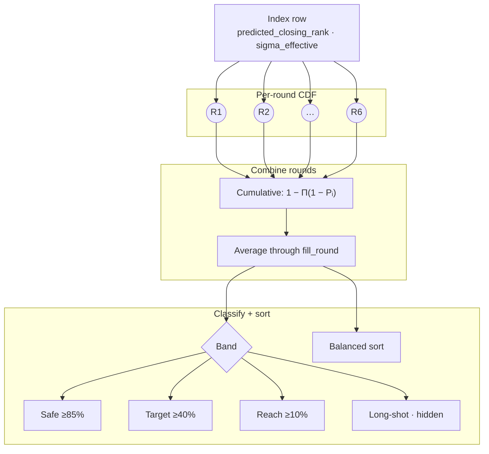

# Prediction engine

Once the index row exists, runtime prediction is pure math. No ML at request time. Each program row already has a predicted closing rank and uncertainty width; student rank plugs into a normal distribution.

## Probability pipeline



## Single-round probability

For one counselling round, chance is the normal CDF:

$$
P_i = \Phi\!\left(\frac{\hat{c}_i - r}{\sigma_{\mathrm{eff}}}\right)
$$

Lower student rank = better rank. When $r = \hat{c}_i$, $P_i \approx 0.5$ by design.

$\sigma_{\mathrm{eff}}$ is at least 1 so division never collapses to zero. Comes from the index build (historical spread, with floors and inflation for sparse data).

CDF uses Abramowitz and Stegun 7.1.26 for the error function. Max error $\sim 5 \times 10^{-5}$, fine for display percentages.

```typescript
const sigma = Math.max(sigmaEffective, 1);
const z = (predictedClosingRank - studentRank) / sigma;
return normalCDF(z);
```

Intuition: $\hat{c}_i$ is the centre of a bell curve. Rank better than centre → above 50%. Worse → below 50%.

## Round-by-round cumulative chance

JoSAA runs up to six rounds. CSAB usually stops at two. The index stores a weighted mean closing rank per round (`round1_mean` … `round6_mean`) plus `fill_round` (typical last round where seats actually fill).

For each round `i` up to `fill_round`:

1. Compute single-round probability $P_i$ from that round's mean.
2. Update cumulative chance:

$$
P_{\mathrm{cum},i} = 1 - \prod_{j=1}^{i}(1 - P_j)
$$

Rounds are treated as independent shots: missing round 1 still leaves room in round 2, and so on.

After `fill_round`, later round slots freeze at the last cumulative value (no fake extra rounds).

The headline number on each result row is the **average** of $P_{\mathrm{cum},i}$ from round 1 through `fill_round`, not just the last round:

$$
\bar{P} = \frac{1}{f}\sum_{i=1}^{f} P_{\mathrm{cum},i}
$$

where $f$ = `fill_round`.

```typescript
const activeProbs = roundProbs.slice(0, fillRound);
return sum(activeProbs) / activeProbs.length;
```

The UI bar chart shows all six round slots. Hover a bar for that round's cumulative chance. The number beside the bars is the average above.

## Band labels

Fixed thresholds in code:

| Band | Threshold |
| --- | --- |
| **Safe** | $P \geq 0.85$ |
| **Target** | $0.40 \leq P < 0.85$ |
| **Reach** | $0.10 \leq P < 0.40$ |
| **Long-shot** | $P < 0.10$ |

```typescript
if (probability >= 0.85) return "safe";
if (probability >= 0.4) return "target";
if (probability >= 0.1) return "reach";
return "long-shot";
```

Programs below 10% are hidden unless `include_all=true`. Keeps the default list focused on options with at least a thin historical path.

## Default result ordering (before sort picker)

API response sorts by band first (Safe, Target, Reach, Long-shot). Inside a band, lower `predicted_closing_rank` first (more competitive program).

UI default is **Balanced**, which re-orders using institute and branch scores ([Balanced ranking](balanced-ranking.md)).

## What the engine does not do

**Seat matrix or vacancy counts.** Cutoff history drives the model. Live vacant seats during counselling are not folded in.

**Choice filling or float logic.** No simulation of what happens if a higher choice is picked elsewhere.

**Board marks or bonus points.** Only rank (and category inputs) for matching index rows.
