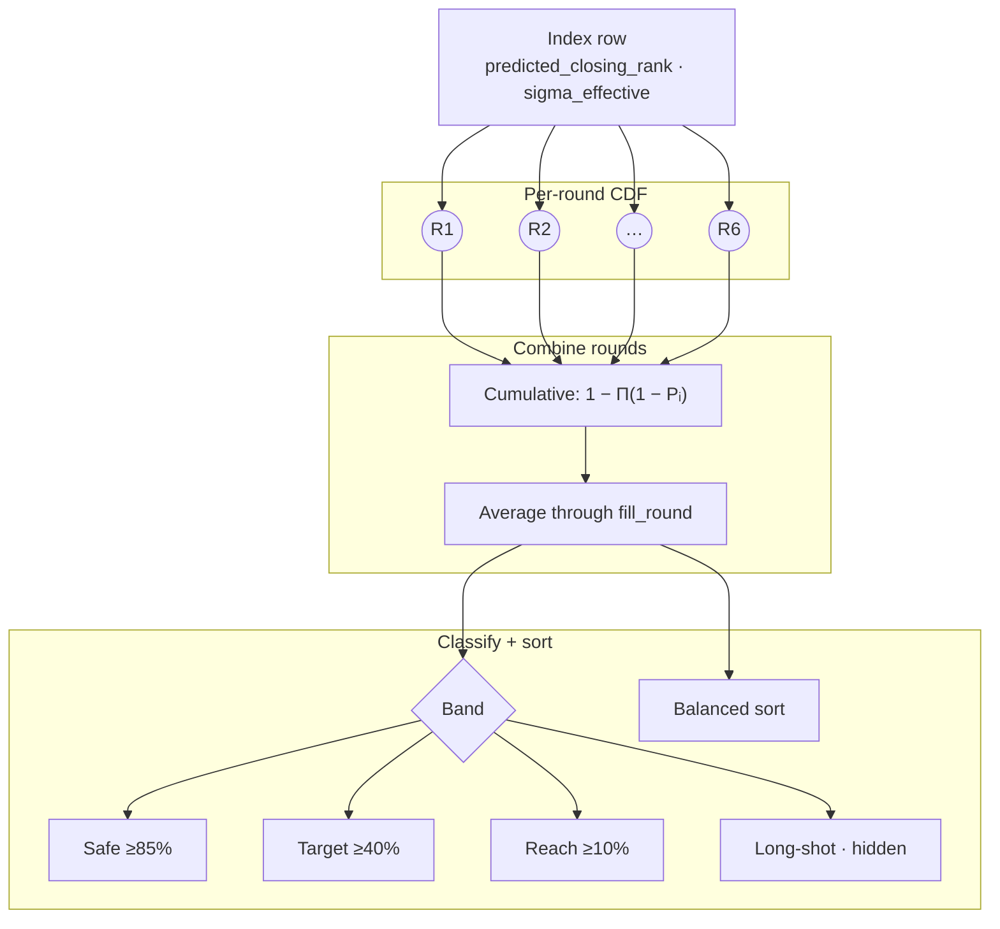

# Prediction engine

Once the index row exists, runtime prediction is pure math. No machine learning at request time. Each program row already carries a predicted closing rank and an uncertainty width. The student rank plugs into a normal distribution.

## Probability pipeline



## Single-round probability

For one counselling round, chance is the normal CDF (cumulative distribution function):

```
P = Φ( (predicted_closing_rank − student_rank) / sigma_effective )
```

Lower student rank means a better rank. When the student rank equals the predicted closing rank, `P ≈ 0.5` by design.

`sigma_effective` is at least 1 so division never collapses to zero. It comes from the index build (historical spread, with floors and inflation for sparse data).

The CDF uses the Abramowitz and Stegun 7.1.26 approximation for the error function. Max error is about `5×10⁻⁵`, which is fine for display percentages.

```typescript
const sigma = Math.max(sigmaEffective, 1);
const z = (predictedClosingRank - studentRank) / sigma;
return normalCDF(z);
```

> **Info:** Intuition: `predicted_closing_rank` is the centre of a bell curve. A rank better than that centre pushes probability above 50%. A worse rank pulls it below 50%.

## Round-by-round cumulative chance

JoSAA runs up to six rounds. CSAB usually stops at two. The index stores a weighted mean closing rank for each round (`round1_mean` … `round6_mean`) plus a `fill_round` (the typical last round where seats actually fill).

For each round `i` up to `fill_round`:

1. Compute single-round probability `P_i` from that round's mean.
2. Update cumulative chance: `P_cumulative = 1 − Π(1 − P_j)` for `j = 1..i`.

This treats rounds as independent shots: missing round 1 still leaves room in round 2, and so on.

After `fill_round`, later round slots freeze at the last cumulative value (no fake extra rounds).

The headline number on each result row is the **average** of cumulative probabilities from round 1 through `fill_round`, not just the last round.

```typescript
const activeProbs = roundProbs.slice(0, fillRound);
return sum(activeProbs) / activeProbs.length;
```

The UI bar chart shows all six round slots. Hovering a bar shows that round's cumulative chance. The number beside the bars is the average described above.

## Band labels

Bands group rows for quick scanning. Thresholds are fixed in code:

| Band | Minimum cumulative probability |
| --- | --- |
| **Safe** | 85% |
| **Target** | 40% |
| **Reach** | 10% |
| **Long-shot** | below 10% |

```typescript
if (probability >= 0.85) return "safe";
if (probability >= 0.4) return "target";
if (probability >= 0.1) return "reach";
return "long-shot";
```

By default, programs below 10% are hidden unless the request sets `include_all=true`. That keeps the list focused on options with at least a thin historical path.

## Default result ordering (before sort picker)

Within the API response, programs sort by band first (Safe, then Target, then Reach, then Long-shot). Inside a band, lower `predicted_closing_rank` comes first (more competitive program).

The UI default sort is **Balanced**, which re-orders using institute and branch scores (see [Balanced ranking](balanced-ranking.md)).

## What the engine does not do

### Seat matrix or vacancy counts

Cutoff history drives the model. Live vacant seats during counselling are not folded in.

### Choice filling or float logic

The model does not simulate what happens if a higher choice is picked elsewhere.

### Board marks or bonus points

Only rank (and category inputs) matter for matching index rows.
